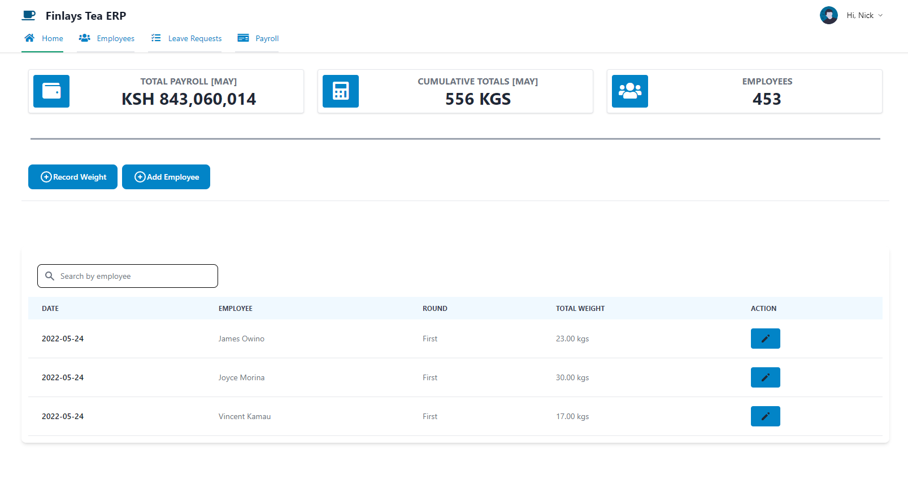
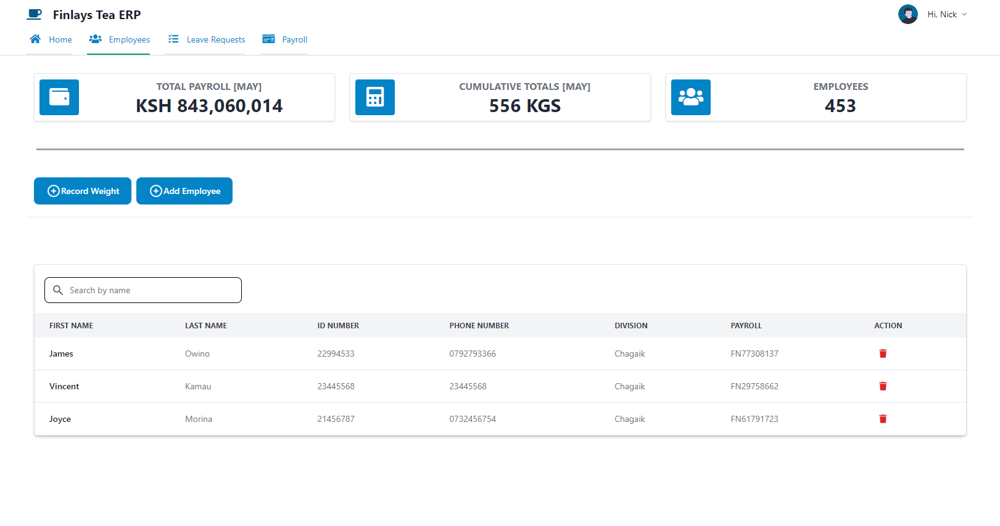
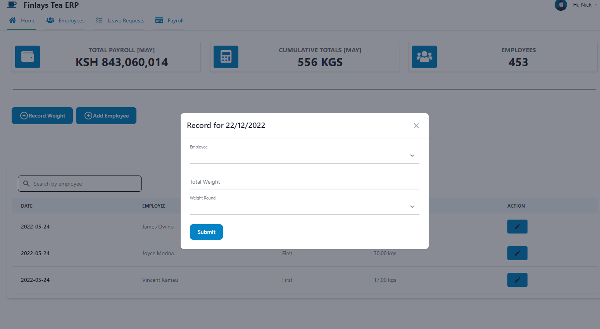
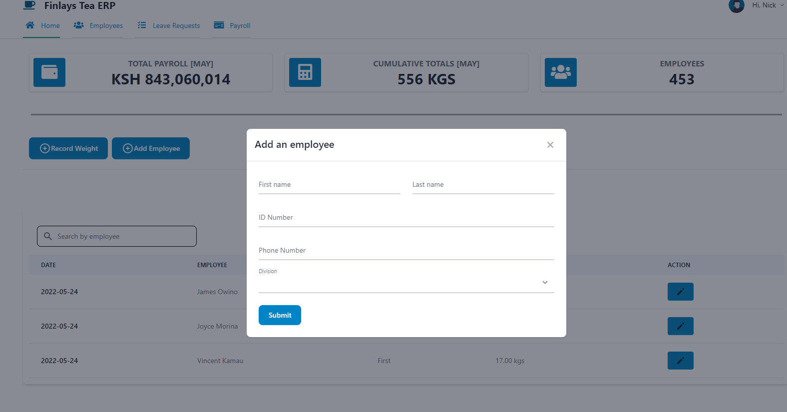

FINLAYS FRONTEND

## APP SCREENS

## Getting started
These instructions will get you a copy of the project up and running in your local machine for development and testing purposes.

## Prerequisites
- [Git](https://git-scm.com/download/)
- [Node Js](https://nodejs.org/en/download/)
- [Vue CLI](https://cli.vuejs.org/guide/installation.html)

### Setting up 
- Create a working space in your local machine
- Clone this [repository](https://github.com/nicksonlangat/finlays_frontend.git) `git clone https://github.com/nicksonlangat/finlays_frontend.git`
- Navigate to the project directory
- Install depedencies `npm install`
- Run the local server `npm run serve`
- Go to `localhost:8080` and view in mobile interface